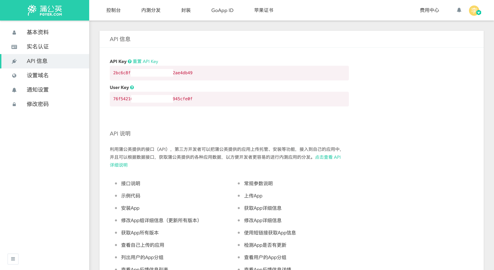

# Getting Started

## Installation

```
dart pub global activate flutter_distributor
```

## Usage

Add `distribute_options.yaml` to your project root directory.

```yaml
output: dist/
```

### Configure A Publisher

Let's take `pgyer` as an example, after logging in, click the user avatar on the right side to go to the [API information](https://www.pgyer.com/account/api) page from the menu, copy the `API Key` and add it to the env node.



```yaml
env:
  PGYER_API_KEY: 'your api key'
```

Check out the [Publishers](configuration/publishers/) documentation for all possible publishers and how to configure them.

### Configure Release Items

The following example shows how to add a release that contains package `apk`, `ipa` and publish to `pgyer.com`, A `release` can include multiple jobs.&#x20;


The `build_args` are the args supported by the `flutter build` command, please modify it according to your project.


```yaml
releases:
  - name: dev
    jobs:
      - name: release-dev-android
        package:
          platform: android
          target: apk
          build_args:
            target: lib/main.dart
            flavor: dev
            target-platform: android-arm,android-arm64
        publish_to: pgyer
      - name: release-dev-ios
        package:
          platform: ios
          target: ipa
          build_args:
            target: lib/main.dart
            flavor: dev
            export-options-plist: ios/dev_ExportOptions.plist
        publish_to: pgyer
```

### Complete Example

```yaml
env:
  PGYER_API_KEY: 'your api key'
output: dist/
releases:
  - name: dev
    jobs:
      - name: release-dev-android
        package:
          platform: android
          target: apk
          build_args:
            target: lib/main.dart
            flavor: dev
            target-platform: android-arm,android-arm64
        publish_to: pgyer
      - name: release-dev-ios
        package:
          platform: ios
          target: ipa
          build_args:
            target: lib/main.dart
            flavor: dev
            export-options-plist: ios/dev_ExportOptions.plist
        publish_to: pgyer
```

### Release Your App

```
flutter_distributor release --name dev
```

## Thank You <a href="#thank-20you" id="thank-20you"></a>

🎉 🎉 🎉
